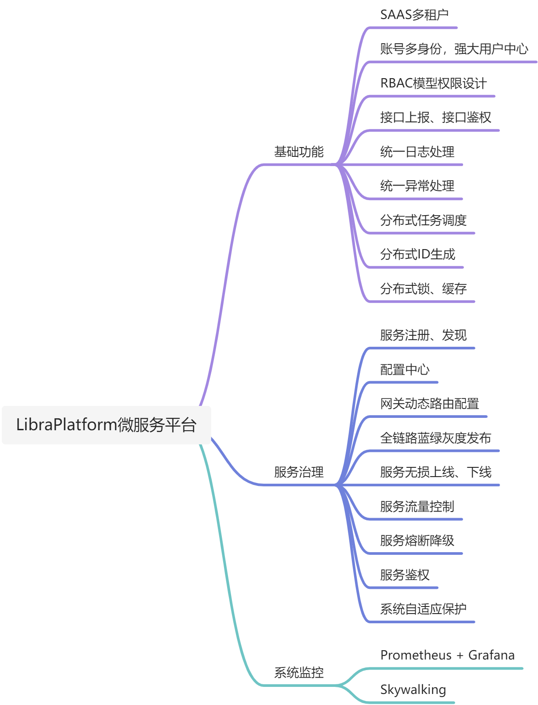

# Libra-Platform 微服务平台
Libra-Platform微服务平台基于SpringCloud(2020.0.x) + SpringCloudAlibaba(2021.x) + SpringBoot(2.4.x) + Vue3开发，基于多租户SaaS模式的设计，拥有强大的用户中心，权限基于RBAC设计，支持蓝绿灰度发布、网关动态路由等功能。Libra-Platform平台架构清晰、代码简介、注解齐全，很适合作为基础框架使用。


    最新代码分支：1.2.x
    稳定分支：master 
    SC&SAC最新版本分支：1.3.0

## 仓库地址

【github】

后端：https://github.com/hfbin/LibraPlatform

前端：https://github.com/hfbin/LibraPlatformUi

【gitee】

后端：https://gitee.com/huangfubin/LibraPlatform

前端：https://gitee.com/huangfubin/LibraPlatformUi

## 相关功能


## 总体架构图


## 在线体验

http://www.librayun.net:8888

**商业合作、技术问题可加微信：Jack-hfbin (添加时请备注好意图)**

欢迎关注我的公众号：java技术会所。  技术干货源源不断。


## 模块说明
```lua
libra-platform -- 父项目
│  │─libra-plugin -- 扩展服务治理功能组件
│  │  ├─libra-plugin-common -- 公共
│  │  ├─libra-plugin-bgg -- 蓝绿灰度发布组件
│  │  ├─libra-plugin-nacos -- nacos二次封装组件
│  │  ├─libra-plugin-sentinel -- sentinel二次封装组件
│  │  ├─libra-plugin-gateway -- 网关组件
│  │  ├─libra-plugin-service -- 非网关组件
│  │  ├─libra-plugin-admin-service -- 暴露动态更新配置服务
│  ├─libra-auth -- 认证授权服务
│  │─libra-common -- 公共工具父级
│  │  ├─libra-common-log -- 封装Log相关
│  │  ├─libra-common-mq -- 封装MQ相关操作
│  │  ├─libra-common-mybatis -- 封装Mybatis Plus相关配置
│  │  ├─libra-common-redis -- 封装Redis相关操作逻辑
│  │  ├─libra-common-security -- 用户鉴权相关处理
│  │  ├─libra-common-springcloud -- 微服务相关组件引用及配置
│  │  ├─libra-common-swagger -- Swagger+Knife4j整合
│  │  ├─libra-core -- 相关公共工具代码封装
│  ├─libra-gateway -- 网关SpringCloud Gateway
│  ├─libra-service -- 业务服务父级
│  │  ├─libra-ucpm -- 用户中心权限菜单服务
│  │  ├─libra-base -- 基础服务
│  │  ├─libra-gen -- 代码生成服务
│  │  ├─libra-tenant -- 租户服务

```
相关组件和服务都有使用说明，在对应组件或者服务下的文件，文件名为README.md

其它说明：全链路蓝绿灰度发布及动态路由使用说明在目录libra-plugin下README.md

## 如何运行项目

```
# 后端工程
git clone https://gitee.com/huangfubin/LibraPlatform.git
说明：启动项目需要依赖nacos（2+）、mysql（5.7+）、redis，启动前请先安装好

安装好之后nacos（可以参考官网如何安装）、mysql、redis
第一步：创建好数据库libra-base、libra-gen、libra-tr、libra-ucpm、nacos。sql文件目录下create-database.sql是创建数据脚本，可以直接执行，执行完之后执行如下脚本（sql文件下）：
    libra-base.sql
    libra-gen.sql
    libra-tr.sql
    libra-ucpm.sql
    nacos.sql（nacos配置中心文件）
第二步：重启搭建好nacos服务，进入nocos控制台修改对应服务配置，比如数据库密码等配置
第三步：启动服务libra-base-service、libra-tenant-service、libra-ucpm-service、libra-auth-service、libra-gateway

# 前端工程
git clone https://gitee.com/huangfubin/LibraPlatformUi.git
npm install --registry=https://registry.npm.taobao.org
npm install
npm run dev

访问地址：http://localhost:9527
```
## 相关工具截图

### APM Skywalking 
拓扑图

仪表盘

调用链路


### Sentinel 熔断限流


### Prometheus + Grafana 监控
服务监控


## Libra-Platform 功能说明

### 租户配置
租户配置包括了两块内容，租户管理和菜单模板。租户管理主要用来创建租户。菜单模板用来配置租户菜单权限模板，此模块的设计主要为了达到不通的租户等级可以配置不通的租户菜单。
#### 租户管理
租户管理功能包括新增、查询、修改、禁用等功能。
- 新增租户时候默认会初始化租户默认部门、默认角色、管理员账号等相关信息（注意：默认的数据在系统是无法操作的，相关的界面及接口都做了判断）
- 特别说明租户编码是作为整个系统数据隔离的重要字段，一旦创建不建议修改，如果要修改需要将相关表的租户字段更新为最新的租户编码，后续作为扩展功能完善

##### 租户列表

##### 新增租户


#### 菜单模板
菜单模板功能包括新增、查询、修改、权限同步等功能。
- 菜单模板修改时候不会将关联此菜单模板的租户权限同步到默认角色里，需要另外操作一下权限同步功能，将此菜单权限同步到租户管理员角色

##### 菜单模板列表

##### 新增菜单模板


### 组织管理
租户配置包括了员工管理、部门管理、角色管理、岗位管理
#### 员工管理
员工管理功能包括新增、查询、修改、重置密码，删除等功能。
- 新增员工的账号和手机号做为账号的唯一标识，部门和角色为必填

##### 员工管理列表

##### 新增员工


#### 部门管理
部门管理功能包括新增、查询、修改、删除等功能。
- 当部门有关联了用户对应的部门是无法删除
- 系统默认部门无法删除，可修改，创建租户时候默认以租户名称创建默认部门
##### 部门管理列表


#### 角色管理
角色管理功能包括新增、查询、修改、删除等功能。
- 角色组及角色在创建租户时候会默认创建，对应的权限无法编辑及删除
##### 角色管理列表


#### 岗位管理
岗位管理功能包括新增、查询、修改、删除等功能。
##### 岗位管理列表


### 系统设置
系统设置包括了菜单管理、接口管理、版本管理、终端管理、操作日志、登录日志
#### 菜单管理
菜单管理功能包括新增、查询、修改、删除、接口权限配置等功能。
- 接口权限配置是用来做接口管理的接口绑定，后端在验证接口权限鉴权时候使用此关联关联数据做校验。此模块设计初衷，当业务线较为复杂时候很多接口会在不同功能模块调用，此时就可以灵活配置接口权限了
- 菜单可以根据不通的应用端去配置
##### 菜单管理列表

##### 新增菜单

##### 接口权限配置


#### 接口管理
接口管理功能包括新增、查询、修改、删除等功能。
- 接口管理可以区分不同应用端的接口，这样更有效管理
##### 接口管理列表


#### 应用管理
应用管理功能包括新增、查询、修改、删除等功能。
- 菜单模块与接口模块需要与应用关联，在不用的应用端只会返回对应端菜单

##### 应用管理列表


#### 操作日志
操作日志模块目前只提供两种类型，操作日志及登录日志，如果需要扩展可对`libra-common-log`组件进行类型扩展。

##### 操作日志列表


### 开发工具
开发工具模块包括数据源管理、代码生成、版本管理。

#### 数据源管理
提供不同数据源配置便捷代码生成模块


#### 代码生成
可切换不同数据源生成代码，代码生成会生成前端页面代码、后端代码、菜单接口sql


#### 版本管理
版本管理模块的主要目的是在迭代推进的过程中我们菜单和接口可能一直在变，此时在切到对应环境时候无需重新添加菜单及接口，此模块会提供一个一键导出当前版本菜单及接口变动的sql文件。
##### 版本管理列表


